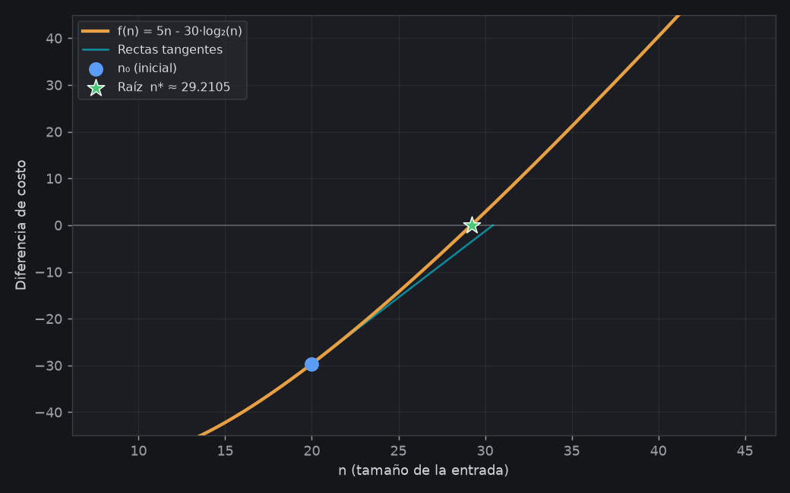

# Proyecto Informático — Método de Newton-Raphson

**Universidad de Mendoza — Facultad de Ingeniería**
**Análisis Numérico — 2026**

**Tema asignado:** Newton-Raphson para la resolución de ecuaciones no lineales
**Integrantes:** Ezequiel Blajevitch · Nahuel Quiroga

---

## 1. Introducción

El método de **Newton-Raphson** es uno de los algoritmos más utilizados en el cálculo
numérico para hallar las **raíces** (ceros) de una ecuación no lineal de la forma:

$$f(x) = 0$$

Muchos problemas de ingeniería no admiten una solución analítica cerrada: aparecen
ecuaciones trascendentes o polinómicas de grado alto cuya raíz solo puede obtenerse de
forma aproximada. Newton-Raphson resuelve este tipo de problema de manera **iterativa**:
partiendo de una aproximación inicial `x₀`, genera una sucesión de valores que —bajo
ciertas condiciones— converge rápidamente al valor de la raíz `α`.

Este proyecto consiste en una **aplicación web interactiva** que implementa el método,
permite ingresar una función arbitraria, calcula automáticamente su derivada, ejecuta las
iteraciones con distintos criterios de parada y muestra los resultados tanto en una **tabla
numérica** como en un **gráfico interactivo** con las rectas tangentes.

---

## 2. Fundamento matemático

### 2.1 Deducción de la fórmula

El método se deduce a partir del **desarrollo de Taylor** de la función alrededor de la
aproximación actual `xₙ`. Si `α` es la raíz buscada y `xₙ` está cerca de ella:

$$f(\alpha) = f(x_n) + f'(x_n)(\alpha - x_n) + \frac{f''(\xi)}{2}(\alpha - x_n)^2 + \dots$$

Como `f(α) = 0`, despreciando los términos de segundo orden y superiores:

$$0 \approx f(x_n) + f'(x_n)(\alpha - x_n)$$

Despejando `α` obtenemos la **fórmula de recurrencia de Newton-Raphson**:

$$\boxed{\,x_{n+1} = x_n - \dfrac{f(x_n)}{f'(x_n)}\,}$$

### 2.2 Interpretación geométrica

En cada paso, el método traza la **recta tangente** a la curva `f(x)` en el punto
`(xₙ, f(xₙ))` y toma como nueva aproximación el punto donde esa tangente **corta al eje X**.
Geométricamente, se está reemplazando la curva por su recta tangente y resolviendo el
problema lineal, mucho más sencillo. Repitiendo el proceso, las aproximaciones se acercan
cada vez más a la raíz.

La aplicación dibuja precisamente estas tangentes sucesivas en la pestaña **Gráfico**, de
modo que el comportamiento del método se puede observar visualmente.

### 2.3 Convergencia

Cuando converge, Newton-Raphson tiene **convergencia cuadrática**: el número de cifras
decimales correctas aproximadamente **se duplica en cada iteración**. Formalmente, el error
`eₙ = xₙ − α` cumple:

$$e_{n+1} \approx \frac{f''(\alpha)}{2\,f'(\alpha)}\, e_n^2$$

Esta convergencia tan rápida es la principal ventaja del método frente a otros (como
bisección, de convergencia lineal). La constante asintótica del error se relaciona con la
cantidad:

$$|g'(x)| = \left|\frac{f(x)\,f''(x)}{\big(f'(x)\big)^2}\right|$$

que la aplicación calcula y muestra en una columna propia de la tabla. Cuando `|g'(xₙ)|`
tiende rápidamente a 0, se confirma la convergencia cuadrática del método.

### 2.4 Condiciones y casos de falla

El método **no siempre converge**. Para garantizar la convergencia conviene que:

- La aproximación inicial `x₀` esté **suficientemente cerca** de la raíz.
- `f'(x) ≠ 0` en el entorno de la raíz (de lo contrario la tangente es horizontal y la
  fórmula se indetermina).
- La función sea **derivable** en el intervalo de trabajo.

Los casos típicos de falla, todos contemplados y reportados por la aplicación, son:

| Situación | Causa | Respuesta del programa |
|-----------|-------|------------------------|
| **Derivada nula** | `f'(xₙ) ≈ 0`: tangente horizontal | Se detiene e informa el punto problemático |
| **No converge** | `x₀` mal elegido / divergencia / ciclos | Se detiene al llegar a `Nₘₐₓ` iteraciones |
| **Función lineal** | La derivada es constante (no tiene sentido el método) | Se rechaza con un aviso |
| **Expresión inválida** | Error de sintaxis en `f(x)` | Mensaje de error de parseo |

---

## 3. Criterios de parada

El método es iterativo, por lo que necesita una condición para **detenerse**. La aplicación
implementa los tres criterios clásicos y permite elegir cuál usar:

| Criterio | Nombre | Condición de parada |
|----------|--------|---------------------|
| **I** | Por imagen | $\lvert f(x_n)\rvert < \text{Tol}$ |
| **II** | Por diferencia absoluta | $\lvert x_n - x_{n-1}\rvert < \text{Tol}$ |
| **III** | Por error relativo | $\dfrac{\lvert x_n - x_{n-1}\rvert}{\lvert x_n\rvert} < \text{Tol}$ |

- **Criterio I** controla qué tan cerca de cero está la función; es el más intuitivo.
- **Criterio II** controla cuánto se mueve la aproximación entre pasos consecutivos.
- **Criterio III** es el Criterio II normalizado: mide el error en términos *relativos* al
  tamaño de la aproximación. Es el más adecuado cuando la raíz es un número grande. No es
  aplicable si `xₙ = 0`.

---

## 4. Descripción del software

### 4.1 Tecnologías utilizadas

| Componente | Tecnología | Función |
|------------|------------|---------|
| Lenguaje / Framework | **JavaScript + React 19** | Interfaz de usuario reactiva |
| Empaquetador | **Vite** | Servidor de desarrollo y *build* de producción |
| Motor matemático | **math.js** | Parseo de expresiones y **derivación simbólica** |
| Gráficos | **Plotly.js** | Gráfico interactivo de la función y las tangentes |
| Render de fórmulas | **KaTeX** | Muestra `f(x)` con notación matemática |

Un aporte clave es que el usuario **no necesita ingresar la derivada manualmente**: la
librería math.js calcula la derivada (y la segunda derivada) de forma **simbólica** a partir
de la expresión escrita, lo que reduce errores y hace la herramienta más accesible.

### 4.2 Arquitectura del código

El proyecto separa la **lógica numérica** de la **interfaz**, lo que facilita su
comprensión y mantenimiento:

```
src/
├── utils/
│   ├── mathEngine.js       → Parseo de f(x) y cálculo simbólico de f'(x) y f''(x)
│   └── stopCriteria.js     → Implementación de los 3 criterios de parada
├── hooks/
│   └── useNewtonRaphson.js → Núcleo del algoritmo (bucle iterativo)
├── components/
│   ├── InputPanel/         → Entrada de f(x), x₀, Tol, Nₘₐₓ y criterio
│   ├── ResultPanel/        → Resultado final, raíz y estado
│   ├── IterationTable/     → Tabla con todas las iteraciones
│   ├── FunctionGraph/      → Gráfico interactivo con las tangentes
│   └── InfoPanel/          → Explicación de uso del método
└── App.jsx                 → Componente raíz, organiza las pestañas
```

### 4.3 Núcleo del algoritmo

El corazón del programa está en [useNewtonRaphson.js](src/hooks/useNewtonRaphson.js). Su
funcionamiento, paso a paso, es:

1. **Parseo y validación** de la expresión `f(x)`; se calcula `f'(x)` y `f''(x)`. Si la
   función es lineal o la sintaxis es inválida, se aborta con un mensaje.
2. Se inicializa `xₙ = x₀`.
3. En cada iteración:
   - Se evalúan `f(xₙ)`, `f'(xₙ)`, `f''(xₙ)` y se calcula `|g'(xₙ)|`.
   - Se registra la fila de la iteración (con su error según el criterio elegido).
   - Si se cumple el **criterio de parada**, se devuelve `xₙ` como raíz.
   - Si `f'(xₙ) ≈ 0`, se detiene por **derivada nula**.
   - Si no, se aplica la fórmula `xₙ₊₁ = xₙ − f(xₙ)/f'(xₙ)`.
4. Si se alcanza `Nₘₐₓ` sin converger, se informa que **no hubo convergencia**.

### 4.4 Instrucciones de ejecución

Requisitos: tener instalado [Node.js](https://nodejs.org).

```bash
# 1. Instalar las dependencias
npm install

# 2. Levantar el servidor de desarrollo
npm run dev
# → abre la URL que muestra la consola (por defecto http://localhost:5173)

# 3. (Opcional) Generar la versión de producción
npm run build
npm run preview
```

---

## 5. Aplicación a la Ingeniería Informática

> **Aplicación en línea:** la calculadora está desplegada y accesible en
> <https://calculadora-newton-raphson.vercel.app/>

### 5.1 Planteo del problema

Un problema clásico de la Ingeniería Informática es **decidir qué algoritmo conviene usar**
para una tarea según el tamaño de la entrada. Muchos algoritmos de ordenamiento de uso real
son **híbridos**: combinan dos algoritmos y eligen uno u otro según el tamaño `n` del arreglo.
Por ejemplo, **Introsort** (el `std::sort` de C++) y **Timsort** (el `sort` de Python y Java)
usan **ordenamiento por inserción** para arreglos chicos y un algoritmo más sofisticado
(*merge/quick sort*) para los grandes. La pregunta de ingeniería es: **¿a partir de qué
tamaño `n` conviene cambiar de algoritmo?**

Supongamos que medimos empíricamente (*benchmark*) el tiempo de ejecución de dos
implementaciones, expresado en nanosegundos:

- **Ordenamiento por inserción** — costo cuadrático: $\;T_{\text{ins}}(n) = 5\,n^2$
- **Ordenamiento por mezcla** (*merge sort*) — costo cuasi-lineal: $\;T_{\text{merge}}(n) = 30\,n\log_2 n$

Para entradas chicas la inserción es más rápida (su constante es menor); para entradas
grandes gana el *merge sort*. El **punto de cruce** `n*` es el tamaño donde ambos cuestan lo
mismo, y es exactamente el umbral óptimo para cambiar de algoritmo. Se obtiene igualando los
costos:

$$5\,n^2 = 30\,n\log_2 n$$

Como `n > 0`, dividimos ambos miembros por `n` y pasamos todo a un lado, obteniendo una
**ecuación no lineal (trascendente)** cuya raíz es el umbral buscado:

$$f(n) = 5\,n - 30\log_2 n = 0$$

Esta ecuación **no tiene solución algebraica cerrada** (mezcla un término lineal con un
logaritmo), por lo que es un caso ideal para resolver con Newton-Raphson.

### 5.2 Resolución con la calculadora

La calculadora usa siempre `x` como nombre de variable, de modo que **`x` representa el tamaño
`n`**. Además, como en math.js `log` es el logaritmo **natural**, usamos la identidad
$\log_2 n = \dfrac{\ln n}{\ln 2}$. La expresión ingresada en la calculadora es:

```
5*x - 30*log(x)/log(2)
```

**Parámetros:** `x₀ = 20`, `Tol = 1e-6`, criterio **I** (por imagen), `Nₘₐₓ = 50`.

La calculadora deriva sola: `f'(x) = 5 − 30 / (log(2)·x)`. Tabla de iteraciones obtenida:

| n | xₙ | f(xₙ) | f'(xₙ) | \|g'(xₙ)\| | Error \|f(xₙ)\| |
|---|------------------|--------------|-----------|------------|----------------|
| 1 | 20.000000000 | −2.965784e+01 | 2.835957 | 3.990e-01 | 2.9658e+01 |
| 2 | 30.457788415 | 4.426764e+00 | 3.578989 | 1.612e-02 | 4.4268e+00 |
| 3 | 29.220913001 | 3.668449e-02 | 3.518840 | 1.502e-04 | 3.6684e-02 |
| 4 | 29.210487834 | 2.755165e-06 | 3.518311 | 1.129e-08 | 2.7552e-06 |
| 5 | 29.210487051 | 5.684342e-14 | 3.518311 | 2.329e-16 | 5.6843e-14 |

**Raíz encontrada:** `n* ≈ 29.21048705`

### 5.3 Gráfica

La pestaña **Gráfico** de la calculadora muestra la función, las rectas tangentes de cada
iteración partiendo de `n₀ = 20` y el marcador de la raíz `n*`:



> *Se puede reemplazar esta imagen por una captura de pantalla de la pestaña «Gráfico» de la
> aplicación desplegada, ingresando la misma función y parámetros.*

### 5.4 Interpretación del resultado

El método converge en **5 iteraciones** a `n* ≈ 29.21`. Como el tamaño de un arreglo es un
número **entero**, el resultado se interpreta así:

- Para arreglos de **menos de ~30 elementos**, conviene usar **ordenamiento por inserción**.
- Para arreglos de **30 elementos o más**, conviene usar **merge sort**.

Por lo tanto, el umbral de cambio del algoritmo híbrido debe fijarse en **n = 30**. Este
resultado es coherente con la práctica real: implementaciones industriales como Introsort y
Timsort usan umbrales del orden de **16 a 32 elementos** para cambiar a inserción.

Además, se aprecia la **convergencia cuadrática** característica de Newton-Raphson: el error
`|f(xₙ)|` decrece como

$$29.7 \;\to\; 4.4 \;\to\; 3.7\times10^{-2} \;\to\; 2.8\times10^{-6} \;\to\; 5.7\times10^{-14}$$

duplicando la cantidad de cifras correctas en cada paso. La columna `|g'(xₙ)|`, que tiende
rápidamente a cero (`0.40 → 2.3×10⁻¹⁶`), confirma numéricamente esa convergencia.

---

## 6. Conclusiones

- Se desarrolló una herramienta funcional, visual e interactiva que implementa correctamente
  el método de Newton-Raphson para la resolución de ecuaciones no lineales.
- La aplicación calcula la **derivada de forma simbólica**, ofrece **tres criterios de
  parada** y contempla todos los **casos de falla** (derivada nula, no convergencia, función
  lineal, sintaxis inválida), informándolos al usuario.
- Los resultados obtenidos verifican experimentalmente la **convergencia cuadrática** del
  método, su principal fortaleza frente a métodos de convergencia lineal.
- La visualización de las rectas tangentes permite **comprender geométricamente** el
  funcionamiento del algoritmo, lo que aporta valor didáctico además de la utilidad práctica
  para resolver problemas de ingeniería.

---

*Análisis Numérico — Método de Newton-Raphson — Ezequiel Blajevitch y Nahuel Quiroga*
